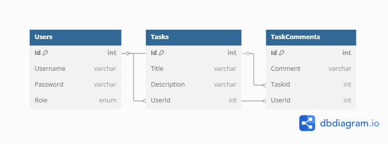

# Database Design Basics

## Schema
- **Users**: Stores user information.
  - `Id`: Primary key (int).
  - `Username`: Required (varchar).
  - `Password`: Required (varchar, plain text for demo).
  - `Role`: Enum (Admin=0, User=1).
- **Tasks**: Stores task details.
  - `Id`: Primary key (int).
  - `Title`: Required (varchar).
  - `Description`: Optional (varchar).
  - `UserId`: Foreign key to `Users`.
- **TaskComments**: Stores comments on tasks.
  - `Id`: Primary key (int).
  - `Comment`: Required (varchar).
  - `TaskId`: Foreign key to `Tasks`.
  - `UserId`: Foreign key to `Users`.

## Relationships
- `Users` 1:N `Tasks` (via `UserId`).
- `Tasks` 1:N `TaskComments` (via `TaskId`).
- `Users` 1:N `TaskComments` (via `UserId`).

## Migration Script
See `migrations.sql` for the SQL schema and seed data.

## ER Diagram

